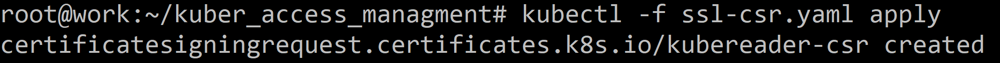
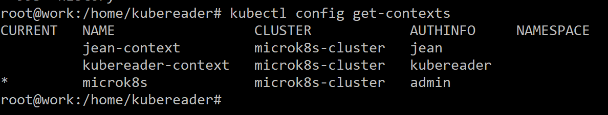
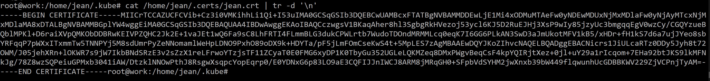

# Домашнее задание к занятию «Управление доступом» - Илларионов Дмитрий

### Цель задания

В тестовой среде Kubernetes нужно предоставить ограниченный доступ пользователю.

------

### Чеклист готовности к домашнему заданию

1. Установлено k8s-решение, например MicroK8S.
2. Установленный локальный kubectl.
3. Редактор YAML-файлов с подключённым github-репозиторием.

------

### Инструменты / дополнительные материалы, которые пригодятся для выполнения задания

1. [Описание](https://kubernetes.io/docs/reference/access-authn-authz/rbac/) RBAC.
2. [Пользователи и авторизация RBAC в Kubernetes](https://habr.com/ru/company/flant/blog/470503/).
3. [RBAC with Kubernetes in Minikube](https://medium.com/@HoussemDellai/rbac-with-kubernetes-in-minikube-4deed658ea7b).

------

### Задание 1. Создайте конфигурацию для подключения пользователя

1. Создайте и подпишите SSL-сертификат для подключения к кластеру.
2. Настройте конфигурационный файл kubectl для подключения.
3. Создайте роли и все необходимые настройки для пользователя.
4. Предусмотрите права пользователя. Пользователь может просматривать логи подов и их конфигурацию (`kubectl logs pod <pod_id>`, `kubectl describe pod <pod_id>`).
5. Предоставьте манифесты и скриншоты и/или вывод необходимых команд.

#### Решение

На рабочей ВМ выполнил (от куда пользователь будет коннектиться): 

```
useradd -m -d /home/kubereader kubereader
cd /home/kubereader
openssl genrsa -out kubereader.key 2048
openssl req -new -key kubereader.key -out kubereader.csr -subj "/CN=kubereader"
```

Появились файлы с закрытым ключем и запроса на сертификат:


Конвертирую:

```
cat kubereader.csr | base64 | tr -d '\n'
```


#### Тут сначало пошло не так, но, оставил для истории, правильное решение см. далее

Копирую код в запрос (создаю файл):

Тут было далее неверное решение - был выбран не тот подписчик, у которого есть ограничения на имя CN, поэтому не заработало, оставляю для истори, решение верное - см. далее.

```
apiVersion: certificates.k8s.io/v1
kind: CertificateSigningRequest
metadata:
  name: kubereader-csr
spec:
  # groups:
  # - system: authenticated
  request: LS0tLS1CRUdJTiBDRVJUSUZJQ0FURSBSRVFVRVNULS0tLS0KTUlJQ1dqQ0NBVUlDQVFBd0ZURVRNQkVHQTFVRUF3d0thM1ZpWlhKbFlXUmxjakNDQVNJd0RRWUpLb1pJaHZjTgpBUUVCQlFBRGdnRVBBRENDQVFvQ2dnRUJBTmhyaWMzQXBGckhnNEF1bmErOVJRYktUVEszVXBRNytQYkRNbCs3Ck9JOEVtSTZuUkVyTVVRR1ZsdEhqdVlxcm9MZGhEWU9pOVhsdEpSN2pIbVZoUHBONVZyTFpOWnV6b3QyeCtqY0UKQ0FtZGNRZFo0M3pvdDZ5SGU0cWtEdHg5N01yMVZscEhUeElWeGZPWFd0L0F3RnBhVDFLeElIMEZ1cE5qMzF6RQpoOGh5ZHJRaUdHSnJEaForeFhjYU1JcC83Z01WbnI1RXpPeVNNTVRyajhRQjg3Q3BlV2NBWFhhRzJrL2RtUzZsCjZuemJWci85U3JoNlc2enZ2VlloR1VMeXZjdGM0V2ZtRGt1enc0NzBZVlpmeE9NVjV1K2EzbkhqVytVTUU5MmUKcXFTNnNxMmdhMXhiM3JIbktJMXBVR1hwZGJNUlc4eWQzNkVZYTRRZStsd25sVlVDQXdFQUFhQUFNQTBHQ1NxRwpTSWIzRFFFQkN3VUFBNElCQVFCelZmMUQyZG9jZnpINnQ5YnUxZU0yNm9RRHk4ckVwRWRYTjZCQ0g2ODc2MGhkCjE5RmRmUDFOSnNYeEFiN1M5ckhCZzNsVUpaY2FrQitUTWtQTDgzR0R2U0cybDdFRFRjQ1pMS0d3OUdMTEF4TGsKc21tTXRqQ0FyQjBqZUZvdW5Vb2MzTkhzL3R3ZGZJN3JtRERIKytOS3ltSnhxdTIvMnNHcG5UTUVOblYrRWRHcwpCbHVOa1I1V2RnMUhuYTdJWG9DMHptd3pQVHJDblNxM3JUNHdDekV4Q1pGdWpTM2FMbWsybFk1SmVWNlkwM1ExClNyTWlYRHdHR3IvaTg5MkRQNXoxcGI0aGxKSVJGN1g2VzBYZUoxNFN0alpzbnlVTTZxNUVPN2tDbCtBSTFqRlkKV1J2b2RCMzIzVTFpNmNtOVBkam5IQ1RKd1ZxN25OdTRFTTBTYUxVTQotLS0tLUVORCBDRVJUSUZJQ0FURSBSRVFVRVNULS0tLS0K
  signerName: kubernetes.io/kube-apiserver-client-kubelet
  usages:
  - digital signature
  - key encipherment
  - server auth
  - client auth
```

Применяю:

```
kubectl -f ssl-csr.yaml apply
```



```
kubectl describe csr kubereader-csr
```


```
kubectl certificate approve kubereader-csr
```


Не сработало:


```
kubectl get csr/${SERVICE}.${NAMESPACE} \
--output=jsonpath="{.status}" \
| jq .
```


Предполагаю проблемв  в 

```
"reason": "SignerValidationFailure"
```
Пробовал еще так:

```
apiVersion: certificates.k8s.io/v1
kind: CertificateSigningRequest
metadata:
  name: kubereader-csr2
spec:
  #groups:
  #- system: authenticated
  request: LS0tLS1CRUdJTiBDRVJUSUZJQ0FURSBSRVFVRVNULS0tLS0KTUlJQ1dqQ0NBVUlDQVFBd0ZURVRNQkVHQTFVRUF3d0thM1ZpWlhKbFlXUmxjakNDQVNJd0RRWUpLb1pJaHZjTgpBUUVCQlFBRGdnRVBBRENDQVFvQ2dnRUJBTmhyaWMzQXBGckhnNEF1bmErOVJRYktUVEszVXBRNytQYkRNbCs3Ck9JOEVtSTZuUkVyTVVRR1ZsdEhqdVlxcm9MZGhEWU9pOVhsdEpSN2pIbVZoUHBONVZyTFpOWnV6b3QyeCtqY0UKQ0FtZGNRZFo0M3pvdDZ5SGU0cWtEdHg5N01yMVZscEhUeElWeGZPWFd0L0F3RnBhVDFLeElIMEZ1cE5qMzF6RQpoOGh5ZHJRaUdHSnJEaForeFhjYU1JcC83Z01WbnI1RXpPeVNNTVRyajhRQjg3Q3BlV2NBWFhhRzJrL2RtUzZsCjZuemJWci85U3JoNlc2enZ2VlloR1VMeXZjdGM0V2ZtRGt1enc0NzBZVlpmeE9NVjV1K2EzbkhqVytVTUU5MmUKcXFTNnNxMmdhMXhiM3JIbktJMXBVR1hwZGJNUlc4eWQzNkVZYTRRZStsd25sVlVDQXdFQUFhQUFNQTBHQ1NxRwpTSWIzRFFFQkN3VUFBNElCQVFCelZmMUQyZG9jZnpINnQ5YnUxZU0yNm9RRHk4ckVwRWRYTjZCQ0g2ODc2MGhkCjE5RmRmUDFOSnNYeEFiN1M5ckhCZzNsVUpaY2FrQitUTWtQTDgzR0R2U0cybDdFRFRjQ1pMS0d3OUdMTEF4TGsKc21tTXRqQ0FyQjBqZUZvdW5Vb2MzTkhzL3R3ZGZJN3JtRERIKytOS3ltSnhxdTIvMnNHcG5UTUVOblYrRWRHcwpCbHVOa1I1V2RnMUhuYTdJWG9DMHptd3pQVHJDblNxM3JUNHdDekV4Q1pGdWpTM2FMbWsybFk1SmVWNlkwM1ExClNyTWlYRHdHR3IvaTg5MkRQNXoxcGI0aGxKSVJGN1g2VzBYZUoxNFN0alpzbnlVTTZxNUVPN2tDbCtBSTFqRlkKV1J2b2RCMzIzVTFpNmNtOVBkam5IQ1RKd1ZxN25OdTRFTTBTYUxVTQotLS0tLUVORCBDRVJUSUZJQ0FURSBSRVFVRVNULS0tLS0K
  signerName:   kubernetes.io/kubelet-serving
  #signerName: kubernetes.io/kube-apiserver-client-kubelet
  usages:
  - digital signature
  - key encipherment
  - server auth
  - client auth
```
Но, результат аналогичный:


- Failed


Разбор сбоя:
Потому что:
https://kubernetes.io/docs/reference/access-authn-authz/certificate-signing-requests/#kubernetes-signers

Если "подписатель" = "kubernetes.io/kube-apiserver-client-kubelet" то:

```
Permitted subjects - organizations are exactly ["system:nodes"], common name is "system:node:${NODE_NAME}".
```
а у меня CN другое. 
Поэтому переделал на другого "подписателя" и еще некоторые ошибки исправил:

#### Теперь правильное ршеение

Создаю запрос на подпись сертификата пользователя:

```
apiVersion: certificates.k8s.io/v1
kind: CertificateSigningRequest
metadata:
  name: kubereader-csr4
spec:
  #groups:
  #- system: authenticated
  request: LS0tLS1CRUdJTiBDRVJUSUZJQ0FURSBSRVFVRVNULS0tLS0KTUlJQ1dqQ0NBVUlDQVFBd0ZURVRNQkVHQTFVRUF3d0thM1ZpWlhKbFlXUmxjakNDQVNJd0RRWUpLb1pJaHZjTgpBUUVCQlFBRGdnRVBBRENDQVFvQ2dnRUJBTmhyaWMzQXBGckhnNEF1bmErOVJRYktUVEszVXBRNytQYkRNbCs3Ck9JOEVtSTZuUkVyTVVRR1ZsdEhqdVlxcm9MZGhEWU9pOVhsdEpSN2pIbVZoUHBONVZyTFpOWnV6b3QyeCtqY0UKQ0FtZGNRZFo0M3pvdDZ5SGU0cWtEdHg5N01yMVZscEhUeElWeGZPWFd0L0F3RnBhVDFLeElIMEZ1cE5qMzF6RQpoOGh5ZHJRaUdHSnJEaForeFhjYU1JcC83Z01WbnI1RXpPeVNNTVRyajhRQjg3Q3BlV2NBWFhhRzJrL2RtUzZsCjZuemJWci85U3JoNlc2enZ2VlloR1VMeXZjdGM0V2ZtRGt1enc0NzBZVlpmeE9NVjV1K2EzbkhqVytVTUU5MmUKcXFTNnNxMmdhMXhiM3JIbktJMXBVR1hwZGJNUlc4eWQzNkVZYTRRZStsd25sVlVDQXdFQUFhQUFNQTBHQ1NxRwpTSWIzRFFFQkN3VUFBNElCQVFCelZmMUQyZG9jZnpINnQ5YnUxZU0yNm9RRHk4ckVwRWRYTjZCQ0g2ODc2MGhkCjE5RmRmUDFOSnNYeEFiN1M5ckhCZzNsVUpaY2FrQitUTWtQTDgzR0R2U0cybDdFRFRjQ1pMS0d3OUdMTEF4TGsKc21tTXRqQ0FyQjBqZUZvdW5Vb2MzTkhzL3R3ZGZJN3JtRERIKytOS3ltSnhxdTIvMnNHcG5UTUVOblYrRWRHcwpCbHVOa1I1V2RnMUhuYTdJWG9DMHptd3pQVHJDblNxM3JUNHdDekV4Q1pGdWpTM2FMbWsybFk1SmVWNlkwM1ExClNyTWlYRHdHR3IvaTg5MkRQNXoxcGI0aGxKSVJGN1g2VzBYZUoxNFN0alpzbnlVTTZxNUVPN2tDbCtBSTFqRlkKV1J2b2RCMzIzVTFpNmNtOVBkam5IQ1RKd1ZxN25OdTRFTTBTYUxVTQotLS0tLUVORCBDRVJUSUZJQ0FURSBSRVFVRVNULS0tLS0K
  # signerName:   kubernetes.io/kubelet-serving
  signerName:   kubernetes.io/kube-apiserver-client
  #signerName: kubernetes.io/kube-apiserver-client-kubelet
  usages:
  # - digital signature
  # - key encipherment
  # - server auth
  - client aut
```


```
kubectl certificate approve kubereader-csr2
```


Сертификат подписан - выпушен.


```
kubectl get csr kubereader-csr4 -o jsonpath={.status.certificate} | base64 --decode > /root/cert.crt
```


```
kubectl get csr/kubereader-csr4 --output=jsonpath="{.status}" | jq .
```


Далее:
2. Настройте конфигурационный файл kubectl для подключения.

Полученый серт кладу в папку пользователя и переименовываю:

```
cd /home/kubereader/
cert.crt /home/kubereader/
cp cert.crt kubereader.crt
```

Создаю пользователя:
```
kubectl config set-credentials kubereader --client-certificate=/home/kubereader/kubereader.crt --client-key=/home/kubereader/kubereader.key
```


Создаю новый контекст:
```
kubectl config set-context kubereader-context --cluster=microk8s-cluster --user=kubereader
```


Посмотреть контекст:
```
kubectl config view
```


Кладу конфиг в папку пользователя:
```
cp /root/kubeconf /home/kubereader/kubeconf
```

Правлю конфиг чтобы контекст kubereader был текущим:


Пробую подключиться:

и это нормально, главное что пробует подключиться от kubereader но права еще не настроены.

Файл конфига для подключения готов.
Далее настрою права.

#### Создание роли 

Подключаюсь опять от админа.

3. Создайте роли и все необходимые настройки для пользователя.
4. Предусмотрите права пользователя. Пользователь может просматривать логи подов и их конфигурацию (`kubectl logs pod <pod_id>`, `kubectl describe pod <pod_id>`).
5. Предоставьте манифесты и скриншоты и/или вывод необходимых команд.

Создаю немйспейс:

```
kubectl create namespace my-project-dev
```


Уже ранее включал на ВМ с кубером:

```
microk8s enable rbac
```


Создаю роль:

```
apiVersion: rbac.authorization.k8s.io/v1
kind: Role
metadata:
  namespace: my-project-dev
  name: reader
rules:
  - apiGroups: [ "" ]
    resources: ["pods","pods/log"]
    verbs: ["get", "watch", "list"]
```


```
kubectl get roles
```


Привязываю роль к пользователю:

```
apiVersion: rbac.authorization.k8s.io/v1
kind: RoleBinding
metadata:
  name: pod-reader
  namespace: my-project-dev
subjects:
- kind: User
  name: kubereader
  apiGroup: rbac.authorization.k8s.io
roleRef:
  kind: Role
  name: reader
  apiGroup: rbac.authorization.k8s.io
```


```
kubectl get rolebinding -n my-project-dev
```


Пробую подключиться от пользователя:


возвращаюсь на подключения админа и создаю деплой.

```
apiVersion: apps/v1
kind: Deployment
metadata:
  name: nginx-my-project
  namespace: ny-project-dev
  labels:
    app: nginx
spec:
  replicas: 1
  selector:
    matchLabels:
      app: nginx
  template:
    metadata:
      labels:
        app: nginx
    spec:
      containers:
      - name: nginx
        image: nginx:1.14.2
        ports:
        - containerPort: 80
      - name: multitool
        image: wbitt/network-multitool
        env:
        - name: HTTP_PORT
          value: "8080"
        - name: HTTPS_PORT
          value: "11443"
        ports:
        - containerPort: 8080
          name: http-port
        - containerPort: 11443
          name: https-port
```


---

Тогда еще пробовал вручную как в статье описано:
https://habr.com/ru/companies/flant/articles/470503/

На воркере (считай на ПК пользователя где нет кубера) выполнил:
```
useradd -m -d /home/jean jean
cd /home/jean/
openssl genrsa -out jean.key 2048
openssl req -new -key jean.key -out jean.csr -subj "/CN=jean"
cat jean.csr
```
Полученный запрос копировал и перенес через буфер обмена на ВМ micro - где микрокубик, но сначала создал дирректорию req:

```
mkdir req
cd req
nano jean.csr
```
записал в файл запрос, скопированный и перенесенный через буфер обмена.

Пробую выполнить подписание:

```
openssl x509 -req -in jean.csr -CA /etc/kubernetes/pki/ca.crt -CAkey /etc/kubernetes/pki/ca.key -CAcreateserial -out jean.crt -days 500
```

Но:


Но, нашел где эти файлы, продвинулся дальше:

```
openssl x509 -req -in jean.csr -CA /var/snap/microk8s/current/certs/ca.crt -CAkey /var/snap/microk8s/current/certs/ca.key -CAcreateserial -out jean.crt -days 500
```


Получил файл с сертификатом:


Опять через буфер обмена переношу пользователя на рабочий ПК:


Т.е. закрытый ключ jean не покидал рабочего ПК (что и положено по безопасности).

Только еще скопировал файлы в папку .certs:


Создаю пользователя:

```
kubectl config set-credentials jean \
--client-certificate=/home/jean/.certs/jean.crt \
--client-key=/home/jean/.certs/jean.key
```


Создаю контекст:

```
kubectl config set-context jean-context \
--cluster=kubernetes --user=jean
```


Неожиданно оказалось что в файле /roor/kubeconf уже обновленные данные - там появилась jean (видимо т.к. он подключен то мкрок8s его подправил):


Но, видимо не корректо кластер указал, т.к. у нас кластер другой, иправляю, еще раз:

```
kubectl config set-context jean-context \
--cluster=microk8s-cluster --user=jean
```


```
kubectl config get-contexts
```


```
kubectl config view
```


Смотрю подключенный конфиг-файл:


Но, при этом сертификат там указан в верху для админа. нужно будет поменять.

Создаю папку .kube для jean и туда помещаю конфиг:

```
cp /root/kubeconf /home/jean/.kube/config
```
Беру данные из серта:

```
cat /home/jean/.certs/jean.crt | tr -d '\n'
```



Копипащу:


B вставляю в файл:

```
nano /home/jean/.kube/config
```
Вставляю что нужно и пока закомментирую то, что не нужно:


```
chown -R jean: /home/jean/
```

Попробовал подключиться от jean:


Пока без успешно.

Пока дальше:

Создаю неймспейс:

```
kubectl create namespace my-project-dev
```


Еще выполнил:

```
microk8s enable rbac
```

Создал файл роли:

```
apiVersion: rbac.authorization.k8s.io/v1beta1
kind: Role
metadata:
  namespace: my-project-dev
  name: reader
rules:
  - apiGroups: [ "" ]
    resources: ["pods","pods/log"]
    verbs: ["get", "watch", "list"]
```

Пробую применить:

```
 kubectl -f role.yaml apply
```
Но, ошибка:


Пока не понял что это значит и в чем причина?


------

### Правила приёма работы

1. Домашняя работа оформляется в своём Git-репозитории в файле README.md. Выполненное домашнее задание пришлите ссылкой на .md-файл в вашем репозитории.
2. Файл README.md должен содержать скриншоты вывода необходимых команд `kubectl`, скриншоты результатов.
3. Репозиторий должен содержать тексты манифестов или ссылки на них в файле README.md.

------

